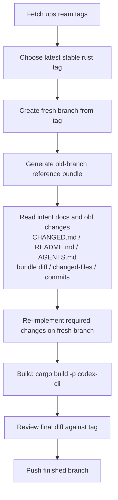

# Codext

An opinionated Codex CLI. This is strictly a personal hobby project, forked from openai/codex.


## Quick Start

Choose one of these two ways:

* Install from npm:

```shell
npm i -g @loongphy/codext
```

* Build from source:

```shell
cd codex-rs
cargo run --bin codex
```

## Features

> Full change log: see [CHANGED.md](./CHANGED.md).

---

### TUI: Status Header

The TUI header provides a compact overview of the active session:
- **Context**: Displays the active model, effort level, and current working directory (`cwd`).
- **Git Status**: Background-polled summary of the repository state for the session `cwd`.
- **Rate Limits**: ChatGPT usage-limit snapshots that refresh while the UI is idle.
- **Account Info**: Email + Plan, API Key


### Copy to Clipboard

* **`Ctrl+Shift+C`**: Copies the current draft to the system clipboard.
* **`Ctrl+C`**: Retains existing behavior; remains backward-compatible with legacy logic when the draft is empty.

### Prompt Queue on usage limit


This feature helps manage follow-up messages when quota or rate limits are reached:

* **Paused and Waiting**: Queued messages wait instead of being sent into more failed turns.
* **Append While Limited**: Even while autosend is paused, you can still press `Tab` to add messages to the queue.
* **Resume on Availability**: Once a later rate-limit snapshot shows quota is available again, Codext sends the **first** queued message.

### Account Switching


Codex now reloads authentication after external `auth.json` writes settle, so account changes can be picked up without restarting at safe boundaries.

* **TUI**: Watches `auth.json` for changes via filesystem notifications, with trailing debounce so reloads happen after writes settle. Auth is deferred until any active task completes; transient read errors do not clear cached auth.
* **App-server**: Reloads auth before `thread/start`, `thread/resume`, and `turn/start` when no turn is running, so the new account is picked up at the next safe request boundary.

This enables auth refresh for TUI and Codex App flows when external tools update `auth.json`.

It also supports Codex App account switching via [codex-auth#103](https://github.com/Loongphy/codex-auth/pull/103).

### Automatic Resumption

After a turn stops on `UsageLimitExceeded`, the TUI can park a recovery prompt and dispatch it after a later `auth.json` reload changes account identity.

You can configure this behavior using `[tui].usage_limit_resume_prompt`:

* **Custom Prompt**: Define a specific string to be sent as the "resumption turn." This prompt will be used to signal the model to continue where it left off.
* **Disable**: Set to `""` (empty string) to disable this automatic recovery behavior entirely.
* **Default**: If left unset, the system uses the following built-in prompt:

  ```text
  Please continue from where the conversation left off after the usage limit reset or account switch.
  ```

  Example:

  ```toml
  [tui]
  usage_limit_resume_prompt = ""
  ```

### AGENTS.md auto reload

AGENTS.md and project-doc instructions are refreshed on each new user turn, and Codex shows an explicit warning when a refresh is applied.

## Project Goals

We will never merge code from the upstream repo; instead, we re-implement our changes on top of the latest upstream code.

Iteration flow (aligned with `.agents/skills/codex-upstream-reapply`):



## Skills

When syncing to the latest upstream codex version, use `.agents/skills/codex-upstream-reapply` to re-implement our custom requirements on top of the newest code, avoiding merge conflicts from the old branch history.

Example:

```
$codex-upstream-reapply old_branch feat/rust-v0.130.0, new origin tag: rust-v0.131.0
```

## Credits

Status bar design reference: <https://linux.do/t/topic/1481797>
